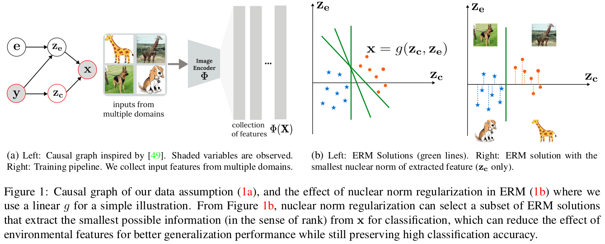
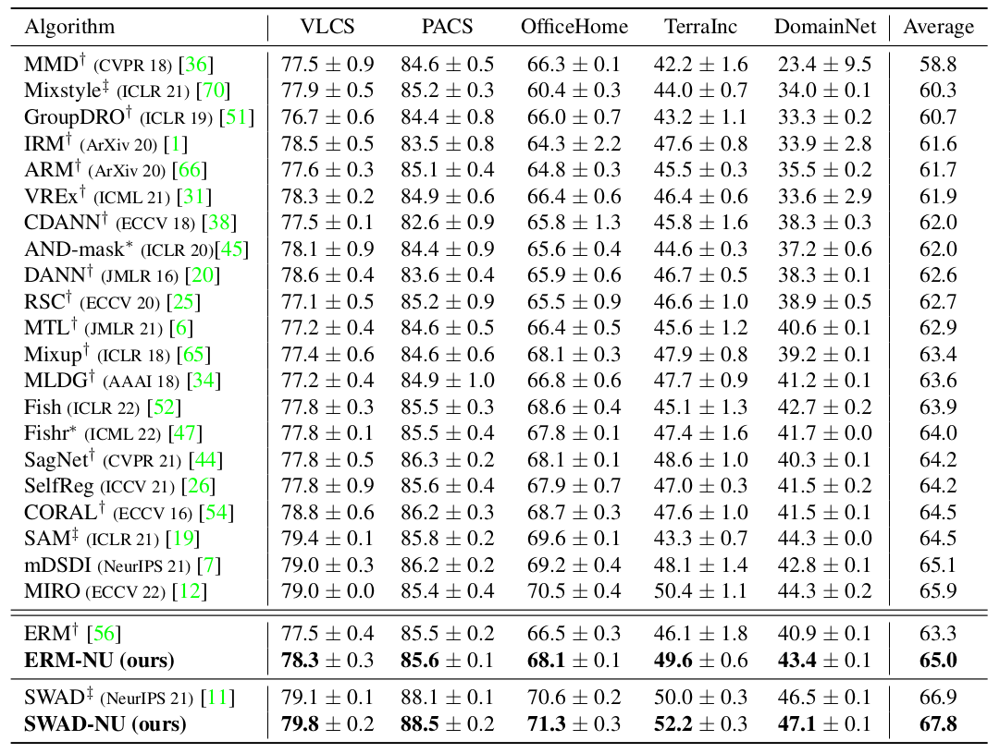

# Domain Generalization via Nuclear Norm Regularization

Official PyTorch implementation of [Domain Generalization via Nuclear Norm Regularization](https://openreview.net/pdf?id=mCKNHWWLd1).

Zhenmei Shi*, Yifei Ming*, Ying Fan*, Frederic Sala, Yingyu Liang.

<p align="center">
    
</p>

## Preparation

### Dependencies

```sh
pip install -r requirements.txt
```

### Datasets

```sh
python -m domainbed.scripts.download --data_dir=/my/datasets/path
```

### Environments

Environment details used for our study.

```
Python: 3.8.6
PyTorch: 1.7.0+cu92
Torchvision: 0.8.1+cu92
CUDA: 9.2
CUDNN: 7603
NumPy: 1.19.4
PIL: 8.0.1
```

## How to Run

`train_all.py` script conducts multiple leave-one-out cross-validations for all target domain.

```sh
python train_all.py exp_name --dataset PACS --data_dir /my/datasets/path
```

Experiment results are reported as a table. In the table, the row `SWAD` indicates out-of-domain accuracy from SWAD.
The row `SWAD (inD)` indicates in-domain validation accuracy.

Example results:
```
+------------+--------------+---------+---------+---------+---------+
| Selection  | art_painting | cartoon |  photo  |  sketch |   Avg.  |
+------------+--------------+---------+---------+---------+---------+
|   oracle   |   82.245%    | 85.661% | 97.530% | 83.461% | 87.224% |
|    iid     |   87.919%    | 78.891% | 96.482% | 78.435% | 85.432% |
|    last    |   82.306%    | 81.823% | 95.135% | 82.061% | 85.331% |
| last (inD) |   95.807%    | 95.291% | 96.306% | 95.477% | 95.720% |
| iid (inD)  |   97.275%    | 96.619% | 96.696% | 97.253% | 96.961% |
|    SWAD    |   89.750%    | 82.942% | 97.979% | 81.870% | 88.135% |
| SWAD (inD) |   97.713%    | 97.649% | 97.316% | 98.074% | 97.688% |
+------------+--------------+---------+---------+---------+---------+
```
In this example, the DG performance of SWAD for PACS dataset is 88.135%.

If you set `indomain_test` option to `True`, the validation set is splitted to validation and test sets,
and the `(inD)` keys become to indicate in-domain test accuracy.


### Main experiments

We provide the instructions to reproduce the main results of the paper, Table 1.
Note that the difference in a detailed environment or uncontrolled randomness may bring a little different result from the paper.

- ERM-NU

```
python train_all.py PACS --dataset PACS --deterministic --checkpoint_freq 100 --data_dir /my/datasets/path  
python train_all.py VLCS --dataset VLCS --deterministic --checkpoint_freq 50 --tolerance_ratio 0.2 --data_dir /my/datasets/path
python train_all.py OH --dataset OfficeHome --deterministic --checkpoint_freq 100 --data_dir /my/datasets/path
python train_all.py TR --dataset TerraIncognita --deterministic --checkpoint_freq 100 --data_dir /my/datasets/path
python train_all.py DN --dataset DomainNet --deterministic --checkpoint_freq 500 --data_dir /my/datasets/path
```

- SWAD-NU

```
python train_all.py PACS --dataset PACS --deterministic --checkpoint_freq 100 --data_dir /my/datasets/path  --swad True
python train_all.py VLCS --dataset VLCS --deterministic --checkpoint_freq 50 --tolerance_ratio 0.2 --data_dir /my/datasets/path --swad True
python train_all.py OH --dataset OfficeHome --deterministic --checkpoint_freq 100 --data_dir /my/datasets/path --swad True
python train_all.py TR --dataset TerraIncognita --deterministic --checkpoint_freq 100 --data_dir /my/datasets/path --swad True
python train_all.py DN --dataset DomainNet --deterministic --checkpoint_freq 500 --data_dir /my/datasets/path --swad True
```

## Main Results

<p align="center">
    
</p>


## License

This project is released under the MIT license, included [here](./LICENSE).

This project include some code from [facebookresearch/DomainBed](https://github.com/facebookresearch/DomainBed) (MIT license) and
[khanrc/swad](https://github.com/khanrc/swad) (MIT license).